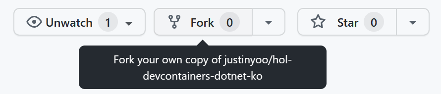
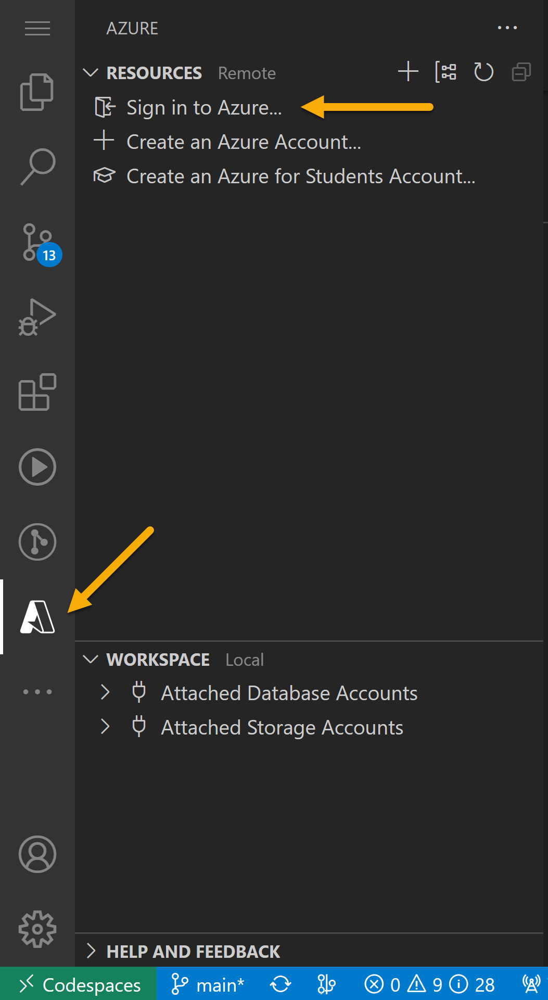
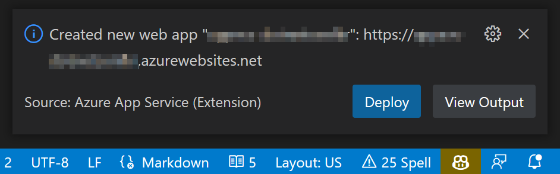
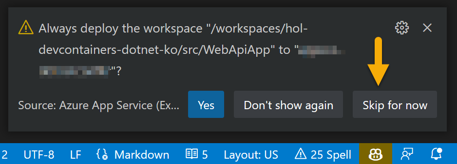
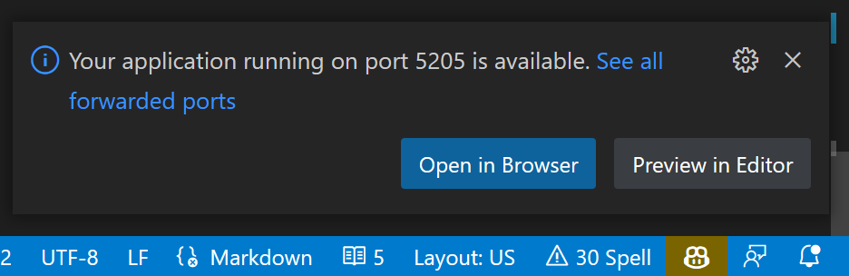

# 닷넷 개발자를 위한 DevContainer 설정 핸즈온 #

## 사전 준비물 ##

* [GitHub 무료 계정](https://github.com/signup)
* [Azure 무료 계정](https://azure.microsoft.com/ko-kr/free?WT.mc_id=dotnet-84111-juyoo)
* [Docker Desktop 개인사용자용](https://www.docker.com/get-started/)
* [Visual Studio Code](https://code.visualstudio.com/Download?WT.mc_id=dotnet-84111-juyoo)
* [Visual Studio Code - Dev Container 익스텐션](https://marketplace.visualstudio.com/items?itemName=ms-vscode-remote.remote-containers&WT.mc_id=dotnet-84111-juyoo)


## Lab 1. GitHub Codespaces 맛보기 ##

1. 이 리포지토리를 자신의 계정으로 fork합니다.

   

2. 현재 코드스페이스 인스턴스가 하나도 없으니 새로 생성합니다.

   

3. 코드스페이스가 생성된 것을 확인한 후 셸 터미널에서 아래 명령어를 입력해 봅니다.

   ```bash
   cat /etc/os-release
   ```

4. 아래 명령어를 입력해 설치된 .NET SDK 버전을 확인해 봅니다.

   ```bash
   dotnet --list-sdks
   ```

5. 아래 명령어를 통해 환경 설정 변수값을 확인해 봅니다.

   ```bash
   printenv
   ```


## Lab 2. DevContainer 설정 ##

1. 리포지토리 루트에 `.devcontainer` 디렉토리를 생성합니다.
2. 이 디렉토리 아래에 아래 두 파일을 생성합니다.

   * `Dockerfile`
   * `devcontainer.json`


### `Dockerfile` ###

DevContainer의 기본이 되는 이미지를 정의합니다. 아래와 같이 입력합니다.

```docker
# [Choice] .NET version: 7.0, 7.0-bullseye-slim, 7.0-jammy, 7.0-focal,
#                        6.0, 6.0-bullseye-slim, 6.0-jammy, 6.0-focal
ARG VARIANT="7.0-jammy"
FROM mcr.microsoft.com/dotnet/sdk:${VARIANT}
```


### `devcontainer.json` ###

1. DevContainer의 기본 설정을 정의합니다. 기본적인 모양은 아래와 같습니다.

   ```jsonc
   {
     "name": "DevContainer 이름",
     
     "build": {
       // 컨테이너 기본 이미지 설정
     },
     
     "forwardPorts": [
       // 포트 포워딩
     ],
     
     "features": {
       // 추가 기능
     },
     
     "overrideFeatureInstallOrder": [
       // 추가 기능 설치 순서
     ],
     
     "customizations": {
       "vscode": {
         // 코드스페이스 커스터마이징
         "extensions": [
           // VS Code 익스텐션
         ],
     
         "settings": {
           // VS Code 환경 설정
         }
       }
     },
   
     // DevContainer 사용자 계정
     "remoteUser": "vscode"
   }
   ```

2. `build` 속성을 아래와 같이 정의합니다.

   ```jsonc
   {
     ...
     "build": {
       "dockerfile": "./Dockerfile",
       "context": ".",
       "args": {
         "VARIANT": "7.0"
       }
     },
     ...
   }
   ```

3. `forwardPorts` 속성을 아래와 같이 정의합니다.

   ```jsonc
   {
     ...
     "forwardPorts": [
       // Azure Function apps
       7071,
       // ASP.NET Core Web/API apps
       5000, 5001,
       // Azure Static Web App CLI
       4280
     ],
     ...
   }
   ```

4. `features` 속성을 아래와 같이 정의합니다.

   ```jsonc
   {
     ...
     "features": {
       // Azure CLI
       "ghcr.io/devcontainers/features/azure-cli:1": {
         "version": "latest",
         "extensions": "account,alias,deploy-to-azure,functionapp,subscription,webapp"
       },

       // GitHub CLI
       "ghcr.io/devcontainers/features/github-cli:1": {
         "version": "latest"
       },

       // node.js
       "ghcr.io/devcontainers/features/node:1": {
         "version": "lts",
         "nodeGypDependencies": true,
         "nvmInstallPath": "/usr/local/share/nvm"
       },

       // common utilities
       "ghcr.io/devcontainers/features/common-utils:1": {
         "installZsh": true,
         "installOhMyZsh": true,
         "upgradePackages": true,
         "username": "vscode",
         "uid": "1000",
         "gid": "1000"
       }
     },
     ...
   }
   ```

5. `features` 속성에 정의한 내용을 순서대로 설치하기 위해 `overrideFeatureInstallOrder` 속성을 아래와 같이 정의합니다.

   ```jsonc
   {
     ...
     "overrideFeatureInstallOrder": [
       "ghcr.io/devcontainers/features/common-utils"
     ],
     ...
   }
   ```

6. 코드스페이스에 설치할 VS Code 익스텐션을 아래와 같이 정의합니다.

   ```jsonc
   {
     ...
     "customizations": {
       "extensions": [
         "ms-dotnettools.csharp",
         "kreativ-software.csharpextensions",
         "ms-vscode.PowerShell",
         "ms-vscode.vscode-node-azure-pack",
         "ms-azuretools.vscode-bicep",
         "VisualStudioExptTeam.vscodeintellicode"
       ],
     },
     ...
   }
   ```

7. 코드스페이스 환경 설정을 아래와 같이 정의합니다.

   ```jsonc
   {
     ...
     "customizations": {
       "settings": {
         "editor.minimap.enabled": false,
         "explorer.sortOrder": "type",
         "explorer.fileNesting.enabled": true,
         "explorer.fileNesting.patterns": {
           "*.bicep": "${capture}.json",
           "*.razor": "${capture}.razor.cs,${capture}.razor.css",
           "*.js": "${capture}.js.map"
         }
       }
     },
     ...
   }
   ```

8. 위와 같이 정의한 후 아래 명령어를 이용해 변경사항을 커밋하고 푸시합니다.

   ```bash
   git add .
   git commit -m "Add devcontainer settings"
   git push origin
   ```

9. `F1` 키룰 눌러 `Codespaces: Full Rebuild Container` 항목을 선택해 변경사항을 적용한 후 다시 DevContainer를 빌드합니다. 이후 아래 명령어를 통해 제대로 각종 도구가 제대로 설치가 되었는지 확인합니다.

   ```bash
   # OS 정보
   cat /etc/os-release

   # .NET SDK 설치 여부
   dotnet --list-sdks

   # 파워셸 설치 여부
   pwsh --version

   # nvm 설치 여부
   nvm --version

   # node 설치 여부
   node --version

   # Azure CLI 설치 여부
   az --version

   # GitHub CLI 설치 여부
   gh --version

   # zsh 설치 여부
   zsh --version

   # oh-my-zsh 설치 여부
   omz version

   # 기타 환경 변수 확인
   printenv
   ```


### 셸 스크립트 (선택) ###

`devcontainer.json` 혹은 `Dockerfile`을 통해 다룰 수 없는 내용을 추가합니다. 예를 들어 `post-create.sh` 라는 셸 스크립트 파일을 생성했다면 이 파일을 `devcontainer.json` 파일을 통해 실행시킬 수 있습니다.

1. `devcontainer.json` 파일의 맨 아래에 아래와 같이 `postCreateCommand` 속성을 추가합니다.

   ```jsonc
   {
     ...
   
     "postCreateCommand": "/bin/bash ./.devcontainer/post-create.sh > ~/post-create.log"
   }
   ```

2. `.devcontainer` 디렉토리 아래에 `post-create.sh` 파일을 만들고 아래 명령어를 추가합니다.

   ```bash
   # Azure Functions Core Tools
   npm i -g azure-functions-core-tools@4 --unsafe-perm true

   # Azure Bicep CLI
   az bicep install

   # Azure Static Web Apps CLI
   npm install -g @azure/static-web-apps-cli

   # Azure Dev CLI
   curl -fsSL https://aka.ms/install-azd.sh | bash
   ```

3. 아래 명령어를 통해 방금 생성한 `post-create.sh` 파일을 실행 가능하도록 권한을 설정합니다.

   ```bash
   chmod +x .devcontainer/post-create.sh
   ```

4. 아래 명령어를 통해 변경사항을 저장하고 리포지토리에 반영합니다.

   ```bash
   git add .
   git commit -m "Update devcontainer settings"
   git push origin
   ```

5. `F1` 키를 눌러 `Codespaces: Full Rebuild Container` 명령을 실행시킵니다. 이후 아래 명령어를 통해 제대로 각종 도구가 제대로 설치가 되었는지 확인합니다.

   ```bash
   # OS 정보
   cat /etc/os-release

   # .NET SDK 설치 여부
   dotnet --list-sdks

   # 파워셸 설치 여부
   pwsh --version

   # nvm 설치 여부
   nvm --version

   # node 설치 여부
   node --version

   # Azure CLI 설치 여부
   az --version

   # Azure Bicep CLI 설치 여부
   az bicep version

   # Azure Functions Core Tools 설치 여부
   func --version

   # Azure Static Web App CLI 설치 여부
   swa --version

   # Azure Dev CLI 설치 여부
   azd version

   # GitHub CLI 설치 여부
   gh --version

   # zsh 설치 여부
   zsh --version

   # oh-my-zsh 설치 여부
   omz version

   # 기타 환경 변수 확인
   printenv
   ```


## Lab 3. ASP.NET Web API 앱 개발 및 배포하기 ##

1. 빈 솔루션 파일을 생성합니다.

   ```bash
   dotnet new sln -n DotNetApps
   ```

2. ASP.NET Web API 앱을 생성합니다.

   ```bash
   dotnet new webapi -n WebApiApp -o src/WebApiApp
   ```

3. 솔루션 파일에 Web API 앱을 연결시킵니다.

   ```bash
   dotnet sln add src/WebApiApp -s src
   ```

4. 솔루션을 빌드합니다.

   ```bash
   dotnet restore && dotnet build
   ```

5. Web API 앱을 실행시킵니다.

   ```bash
   dotnet run --project src/WebApiApp
   ```

6. 포트 번호를 확인하세요. 아래는 예시입니다.

   

7. 만약 공통의 포트 번호로 바꾸고 싶다면 아래와 같이 `src/WebApiApp/Properties/launchSettings.json` 파일을 수정하세요.

   ```jsonc
   {
     "$schema": "https://json.schemastore.org/launchsettings.json",
     ...
     "profiles": {
       "http": {
         ...
         // 포트 번호를 아래와 같이 수정하세요
         "applicationUrl": "http://localhost:5000",
         ...
       },
       "https": {
         ...
         // 포트 번호를 아래와 같이 수정하세요
         "applicationUrl": "https://localhost:5001;http://localhost:5000",
         ...
       },
       ...
     }
   }
   ```

8. Azure에 배포하기 위해서는 먼저 앱의 아티팩트를 생성해야 합니다. 아래 명령어를 입력하세요.

   ```bash
   dotnet publish -c Release
   ```

9. 아티팩트가 만들어지면 왼쪽의 Azure 로고를 클릭한 후 "Sign in to Azure..." 메뉴를 클릭합니다.

   

10. `F1` 키를 눌러 `Azure App Service: Create New Web App` 메뉴를 선택합니다.
11. Web App의 이름을 입력합니다.
12. .NET 런타임을 .NET 7으로 선택합니다.
13. Free(F1) 티어를 선택합니다.
14. 새 Web App이 만들어졌습니다. "Deploy" 버튼을 클릭해서 WebApiApp을 배포합니다.

   

15. 앱을 배포할 디렉토리를 `src/WebApiApp/bin/Release/net7.0/publish`으로 선택합니다.
16. 아래와 같은 질문이 나오면 여기서는 "Skip for now" 또는 "Yes"를 선택합니다.

   

17. 배포가 끝났다는 메시지가 나오면 "Browse Website" 버튼을 클릭합니다.
18. 404 에러가 나타날 경우 `/WeatherForecast` 엔드포인트를 추가합니다.
19. Azure 포털에서 Azure Web App 인스턴스를 삭제합니다.


## Lab 4. Blazor WebAssembly 앱 개발 및 배포하기 ##

> **NOTE:** 시간이 허락할 경우 추가로 진행합니다.

1. Blazor WebAssembly 앱을 생성합니다.

   ```bash
   dotnet new blazorwasm -n BlazorApp -o src/BlazorApp
   ```

2. 솔루션 파일에 Blazor 앱을 연결시킵니다.

   ```bash
   dotnet sln add src/BlazorApp -s src
   ```

3. 솔루션을 빌드합니다.

   ```bash
   dotnet restore && dotnet build
   ```

4. Blazor 앱을 실행시킵니다.

   ```bash
   dotnet run --project src/BlazorApp
   ```

5. 포트 번호를 확인하세요. 아래는 예시입니다.

   

6. 만약 공통의 포트 번호로 바꾸고 싶다면 아래와 같이 `src/BlazorApp/Properties/launchSettings.json` 파일을 수정하세요.

   ```jsonc
   {
     "$schema": "https://json.schemastore.org/launchsettings.json",
     ...
     "profiles": {
       "http": {
         ...
         // 포트 번호를 아래와 같이 수정하세요
         "applicationUrl": "http://localhost:5000",
         ...
       },
       "https": {
         ...
         // 포트 번호를 아래와 같이 수정하세요
         "applicationUrl": "https://localhost:5001;http://localhost:5000",
         ...
       },
       ...
     }
   }
   ```

7. Azure에 배포하기 위해서는 몇가지 사전 작업이 필요합니다. 먼저 앱의 아티팩트를 생성해야 합니다. 아래 명령어를 입력하세요.

   ```bash
   dotnet publish -c Release
   ```

8. 아래 명령어를 이용해 Azure Static Web Apps 환경을 설정합니다.

   ```bash
   swa init
   ```

   `swa-cli.config.json` 파일이 만들어집니다.

9. 이 `swa.cli.config.json` 파일을 아래와 같이 수정합니다.

   ```jsonc
   {
     "$schema": "https://aka.ms/azure/static-web-apps-cli/schema",
     "configurations": {
       "hol-devcontainers-dotnet-ko": {
         "appLocation": "src/BlazorApp",
   
         // outputLocation, appBuildCommand 수정
         "outputLocation": "bin/Release/net7.0/publish/wwwroot",
         "appBuildCommand": "dotnet publish -c Release",
   
         "run": "dotnet watch run",

         // 포트 번호 수정
         "appDevserverUrl": "http://localhost:5000"
       }
     }
   }
   ```
 
9. Azure CLI를 이용해서 Azure에 로그인합니다.

   ```bash
   az login --use-device-code
   ```

10. 아래 명령어를 통해 Azure Static Web App 인스턴스를 생성합니다.

    ```bash
    location=eastasia
    name=dotnetconfkr
    rg=rg-$name
    sttapp=sttapp-$name-$RANDOM

    az group create -n $rg -l $location
    az staticwebapp create -n $sttapp -g $rg -l $location
    ```

11. 아래 명령어를 통해 Azure Static Web App 인스턴스의 배포 키를 받아옵니다.

    ```bash
    token=$(az staticwebapp secrets list -g $rg -n $sttapp --query "properties.apiKey" -o tsv)
    ```

12. 아래 명령어를 통해 Blazor 앱을 Azure Static Web App 인스턴스로 배포합니다.

    ```bash
    swa deploy -d $token --env default
    ```

13. 배포된 앱을 확인합니다.
14. 배포된 앱을 아래 명령어를 이용해 삭제합니다.

    ```bash
    az group delete -n $rg
    ```
